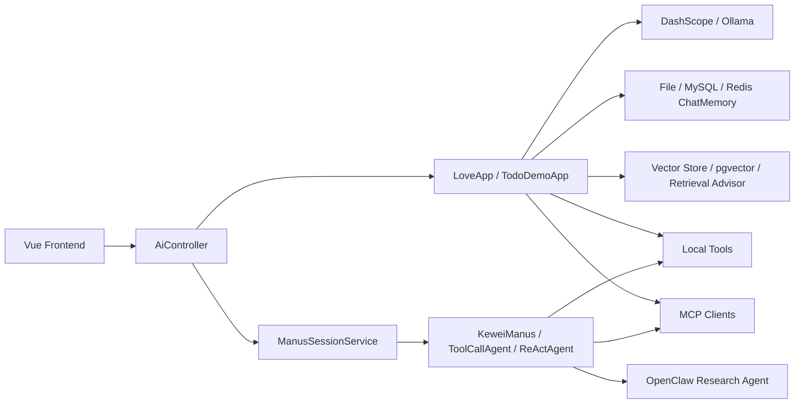

# Kewei AI Agent

一个基于 Spring Boot + Spring AI 的 AI Agent 学习型工程项目。  
这个项目不是“调用一下大模型接口”的聊天 Demo，而是围绕 AI 应用后端常见能力，逐步把多模型接入、RAG、Tools、MCP、多步 Agent、流式交互、会话状态管理和前后端联调做成一套可运行、可演示、可继续扩展的工程作品。

> 项目定位：学习项目，但按工程作品的标准去设计、实现和整理。  
> 适合场景：练手、作为 Spring AI / AI Agent 实践模板继续扩展。  
> 开发过程记录见：[PROCEDURES.md](/Users/zhukewei/Downloads/dev/codes/kewei-ai-agent/PROCEDURES.md)

## 我完成了什么

从后端工程角度，这个项目重点体现的是：

- 基于 Spring Boot + Spring AI 组织 AI 应用基础设施
- 把聊天、RAG、Tools、MCP、Agent 等能力统一收敛到可复用的应用层
- 处理多数据源、多模型 Bean、会话状态、异常包装、SSE 事件流这些工程细节
- 为复杂任务设计了 Manus 多步执行链路，支持 TodoWrite、用户补充信息、任务续跑
- 完整的测试覆盖和前后端联调，保证了代码的可验证性，健壮性和可演示性

## 技术栈

`Java` `Spring Boot` `Spring AI` `Maven` `MyBatis-Plus` `MySQL` `Redis` `PostgreSQL / pgvector` `Ollama` `DashScope` `Vue 3` `SSE` `MCP`

## 功能地图

| 模块 | 当前能力 |
| --- | --- |
| 模型接入 | DashScope、Ollama |
| 对话能力 | 同步、流式、结构化输出、多模态图片对话 |
| 会话记忆 | file / mysql / redis 可切换 |
| RAG | Markdown 文档加载、向量化、检索增强、关键词增强、状态过滤 |
| Tools | 文件读写、网页搜索、网页抓取、资源下载、PDF 转图、邮件发送、时间查询、PPT 生成 |
| MCP | 图片搜索 MCP Server、图片生成 MCP Server |
| Agent | ReAct、多步 Tool Calling、终止机制、TodoWrite、AskUserQuestion |
| Research | Spring AI 主控 + OpenClaw 调研执行代理 |
| 前端联调 | 聊天界面、流式渲染、问题补充、Todo 进度展示 |

## 项目架构



这套工程不是把所有 AI 能力都直接塞进 Controller，而是按“接口层 -> 应用编排层 -> Agent 层 -> 基础设施层 -> 外部能力层”拆开。这样做的目的很明确：让简单对话、RAG 问答、工具调用、多步任务执行都能复用同一套底层能力，同时又能在上层按场景自由组合。

### 1. 接口层：负责暴露能力，不承担复杂编排

- 前端通过聊天页、SSE 流式接口、图片上传接口进入后端。
- [`src/main/java/com/kiwi/keweiaiagent/controller/AiController.java`](/Users/zhukewei/Downloads/dev/codes/kewei-ai-agent/src/main/java/com/kiwi/keweiaiagent/controller/AiController.java) 作为统一入口，负责接收请求、选择调用哪种应用能力，并把结果包装成普通响应或流式事件。
- 这一层尽量薄，不直接处理 RAG、Tool 调用、会话记忆实现细节，也不直接持有复杂 Agent 状态。

### 2. 应用编排层：把聊天、RAG、Tools、MCP 组织成可复用能力

- [`src/main/java/com/kiwi/keweiaiagent/app/LoveApp.java`](/Users/zhukewei/Downloads/dev/codes/kewei-ai-agent/src/main/java/com/kiwi/keweiaiagent/app/LoveApp.java) 是项目里最核心的应用编排类，面向“单轮或多轮 AI 能力调用”这个层级。
- 它负责把模型、Prompt、会话记忆、检索增强、工具、MCP 客户端这些能力按场景组合起来，对 Controller 暴露更稳定的调用接口。
- [`src/main/java/com/kiwi/keweiaiagent/app/TodoDemoApp.java`](/Users/zhukewei/Downloads/dev/codes/kewei-ai-agent/src/main/java/com/kiwi/keweiaiagent/app/TodoDemoApp.java) 则更偏向示例型应用，展示如何用相同底座承载特定任务流。

可以把这一层理解成“面向业务场景的 AI Service”，它屏蔽了底层 Bean 装配、Provider 差异和能力拼接细节。

### 3. Agent 层：负责多步决策、任务续跑和人机协作

- 当请求不再是一次性问答，而是“需要拆步骤、调用多个工具、在中途向用户追问、根据结果继续执行”的复杂任务时，就进入 Agent 层。
- [`src/main/java/com/kiwi/keweiaiagent/agent/KeweiManus.java`](/Users/zhukewei/Downloads/dev/codes/kewei-ai-agent/src/main/java/com/kiwi/keweiaiagent/agent/KeweiManus.java)、[`src/main/java/com/kiwi/keweiaiagent/agent/ToolCallAgent.java`](/Users/zhukewei/Downloads/dev/codes/kewei-ai-agent/src/main/java/com/kiwi/keweiaiagent/agent/ToolCallAgent.java)、[`src/main/java/com/kiwi/keweiaiagent/agent/ReActAgent.java`](/Users/zhukewei/Downloads/dev/codes/kewei-ai-agent/src/main/java/com/kiwi/keweiaiagent/agent/ReActAgent.java) 组成了多步执行能力的核心。
- [`src/main/java/com/kiwi/keweiaiagent/agent/ManusSessionService.java`](/Users/zhukewei/Downloads/dev/codes/kewei-ai-agent/src/main/java/com/kiwi/keweiaiagent/agent/ManusSessionService.java) 负责管理任务生命周期，包括启动任务、保存上下文、补充用户问题、继续执行。
- [`src/main/java/com/kiwi/keweiaiagent/agent/ManusSessionStore.java`](/Users/zhukewei/Downloads/dev/codes/kewei-ai-agent/src/main/java/com/kiwi/keweiaiagent/agent/ManusSessionStore.java) 负责把运行态数据落下来，例如 Todo 快照、待回答问题、Agent 状态等。

这意味着项目里的 Agent 不是“调一次模型让它自己想”，而是带有明确状态管理和任务恢复机制的执行器。

### 4. 基础设施层：提供模型、记忆、检索、异常和响应规范

这一层不直接面向用户，但决定了整个项目能不能稳定扩展。

- 模型接入：
  [`src/main/java/com/kiwi/keweiaiagent/config/AiModelPrimaryConfig.java`](/Users/zhukewei/Downloads/dev/codes/kewei-ai-agent/src/main/java/com/kiwi/keweiaiagent/config/AiModelPrimaryConfig.java) 负责多模型装配，统一 DashScope、Ollama 等 Provider 的主 Bean 选择。
- 会话记忆：
  [`src/main/java/com/kiwi/keweiaiagent/config/ChatMemoryConfig.java`](/Users/zhukewei/Downloads/dev/codes/kewei-ai-agent/src/main/java/com/kiwi/keweiaiagent/config/ChatMemoryConfig.java)、[`src/main/java/com/kiwi/keweiaiagent/chatmemory/FileBaseChatMemory.java`](/Users/zhukewei/Downloads/dev/codes/kewei-ai-agent/src/main/java/com/kiwi/keweiaiagent/chatmemory/FileBaseChatMemory.java)、[`src/main/java/com/kiwi/keweiaiagent/chatmemory/MySqlChatMemory.java`](/Users/zhukewei/Downloads/dev/codes/kewei-ai-agent/src/main/java/com/kiwi/keweiaiagent/chatmemory/MySqlChatMemory.java)、[`src/main/java/com/kiwi/keweiaiagent/chatmemory/MyRedisChatMemory.java`](/Users/zhukewei/Downloads/dev/codes/kewei-ai-agent/src/main/java/com/kiwi/keweiaiagent/chatmemory/MyRedisChatMemory.java) 让 file / mysql / redis 三种记忆实现可以切换。
- RAG：
  [`src/main/java/com/kiwi/keweiaiagent/rag/LoveAppVectorStoreConfig.java`](/Users/zhukewei/Downloads/dev/codes/kewei-ai-agent/src/main/java/com/kiwi/keweiaiagent/rag/LoveAppVectorStoreConfig.java)、[`src/main/java/com/kiwi/keweiaiagent/rag/PgVectorVectorLoadMarkdownConfig.java`](/Users/zhukewei/Downloads/dev/codes/kewei-ai-agent/src/main/java/com/kiwi/keweiaiagent/rag/PgVectorVectorLoadMarkdownConfig.java)、[`src/main/java/com/kiwi/keweiaiagent/rag/LoveAppDocumentLoader.java`](/Users/zhukewei/Downloads/dev/codes/kewei-ai-agent/src/main/java/com/kiwi/keweiaiagent/rag/LoveAppDocumentLoader.java)、[`src/main/java/com/kiwi/keweiaiagent/query/QueryPreprocessor.java`](/Users/zhukewei/Downloads/dev/codes/kewei-ai-agent/src/main/java/com/kiwi/keweiaiagent/query/QueryPreprocessor.java) 共同完成文档加载、向量写入、查询预处理、关键词增强和检索增强。
- 接口规范与异常治理：
  [`src/main/java/com/kiwi/keweiaiagent/common/BaseResponse.java`](/Users/zhukewei/Downloads/dev/codes/kewei-ai-agent/src/main/java/com/kiwi/keweiaiagent/common/BaseResponse.java)、[`src/main/java/com/kiwi/keweiaiagent/config/GlobalResponseBodyAdvice.java`](/Users/zhukewei/Downloads/dev/codes/kewei-ai-agent/src/main/java/com/kiwi/keweiaiagent/config/GlobalResponseBodyAdvice.java)、[`src/main/java/com/kiwi/keweiaiagent/exception/GlobalExceptionHandler.java`](/Users/zhukewei/Downloads/dev/codes/kewei-ai-agent/src/main/java/com/kiwi/keweiaiagent/exception/GlobalExceptionHandler.java) 统一接口出参和错误处理。

### 5. 外部能力层：Tools、MCP 与 Research Agent 作为可插拔扩展点

- 本地工具由 [`src/main/java/com/kiwi/keweiaiagent/tools/ToolRegistration.java`](/Users/zhukewei/Downloads/dev/codes/kewei-ai-agent/src/main/java/com/kiwi/keweiaiagent/tools/ToolRegistration.java) 统一注册，再交给应用层或 Agent 层按需使用。
- 工具能力覆盖文件操作、网页搜索、网页抓取、PDF 转图、邮件、PPT、时间查询、下载等。
- [`src/main/java/com/kiwi/keweiaiagent/tools/OpenClawResearchTool.java`](/Users/zhukewei/Downloads/dev/codes/kewei-ai-agent/src/main/java/com/kiwi/keweiaiagent/tools/OpenClawResearchTool.java) 代表一种更强的“外部代理协作”方式，即把调研任务委派给 OpenClaw，再把结果回收进当前执行链路。
- `kewei-image-search-mcp-server` 和 `kewei-image-generation-mcp-server` 把图片搜索、图片生成能力放到独立 MCP Server 中，而不是直接硬编码进主应用。

这种设计的好处是：新增能力时，通常不需要改 Controller 或重写主流程，只需要新增 Tool、MCP Client 或一个更清晰的应用编排入口。

### 6. 两条最典型的调用链

#### 普通聊天 / RAG 问答链路

1. 前端调用 [`AiController`](/Users/zhukewei/Downloads/dev/codes/kewei-ai-agent/src/main/java/com/kiwi/keweiaiagent/controller/AiController.java)
2. Controller 转给 [`LoveApp`](/Users/zhukewei/Downloads/dev/codes/kewei-ai-agent/src/main/java/com/kiwi/keweiaiagent/app/LoveApp.java)
3. `LoveApp` 按配置挂载 ChatMemory、RAG Advisor、Tools 或 MCP Client
4. 底层模型完成推理后返回普通结果或 SSE 流
5. 响应包装层统一格式返回给前端

这条链路强调的是“能力组合”，适合问答、知识检索、图片理解、流式输出这类相对确定的交互。

#### Manus 多步任务链路

1. 前端发起复杂任务或继续上一次任务
2. [`ManusSessionService`](/Users/zhukewei/Downloads/dev/codes/kewei-ai-agent/src/main/java/com/kiwi/keweiaiagent/agent/ManusSessionService.java) 创建或恢复会话
3. [`KeweiManus`](/Users/zhukewei/Downloads/dev/codes/kewei-ai-agent/src/main/java/com/kiwi/keweiaiagent/agent/KeweiManus.java) 进入多步推理和 Tool Calling
4. 执行过程中可能调用 TodoWrite、AskUserQuestion、Terminate、OpenClawResearchTool 等能力
5. 中间状态写入 [`ManusSessionStore`](/Users/zhukewei/Downloads/dev/codes/kewei-ai-agent/src/main/java/com/kiwi/keweiaiagent/agent/ManusSessionStore.java)
6. 若需要用户补充信息，则前端收到 `question` 事件后继续提交，任务从上次状态续跑

这条链路强调的是“状态驱动的任务执行”，适合多步骤研究、资料收集、结果生成、需要人机协作补充上下文的任务。

### 7. 为什么这个架构适合继续扩展

- 如果要新增模型，优先改配置层和应用层装配，不必动现有业务入口。
- 如果要新增知识库能力，主要扩展文档加载、向量写入和检索增强工厂。
- 如果要新增工具，只要在 `tools` 下补实现并接入注册即可被应用层或 Agent 层复用。
- 如果要新增一个领域 Agent，可以复用当前的会话管理、Todo、提问、终止机制，而不是从零再写一套执行框架。

因此，这个项目的重点不是“模块很多”，而是这些模块之间的职责边界比较清楚，能支撑继续往生产级工程方向演进。

## 核心模块

### 1. 应用层

- [`src/main/java/com/kiwi/keweiaiagent/app/LoveApp.java`](/Users/zhukewei/Downloads/dev/codes/kewei-ai-agent/src/main/java/com/kiwi/keweiaiagent/app/LoveApp.java)
  统一封装文本对话、结构化输出、多模态、RAG、Tools、MCP、会话记忆等能力。
- [`src/main/java/com/kiwi/keweiaiagent/controller/AiController.java`](/Users/zhukewei/Downloads/dev/codes/kewei-ai-agent/src/main/java/com/kiwi/keweiaiagent/controller/AiController.java)
  暴露同步、流式、SSE、图片上传、Agent 相关接口。

### 2. Agent 与会话状态

- [`src/main/java/com/kiwi/keweiaiagent/agent/KeweiManus.java`](/Users/zhukewei/Downloads/dev/codes/kewei-ai-agent/src/main/java/com/kiwi/keweiaiagent/agent/KeweiManus.java)
  应用级多工具 Agent。
- [`src/main/java/com/kiwi/keweiaiagent/agent/ManusSessionService.java`](/Users/zhukewei/Downloads/dev/codes/kewei-ai-agent/src/main/java/com/kiwi/keweiaiagent/agent/ManusSessionService.java)
  管理任务启动、续跑、问题补充和工具子集选择。
- [`src/main/java/com/kiwi/keweiaiagent/agent/ManusSessionStore.java`](/Users/zhukewei/Downloads/dev/codes/kewei-ai-agent/src/main/java/com/kiwi/keweiaiagent/agent/ManusSessionStore.java)
  保存运行状态、中间问题和 Todo 快照。

### 3. RAG 与检索增强

- [`src/main/java/com/kiwi/keweiaiagent/rag/LoveAppVectorStoreConfig.java`](/Users/zhukewei/Downloads/dev/codes/kewei-ai-agent/src/main/java/com/kiwi/keweiaiagent/rag/LoveAppVectorStoreConfig.java)
- [`src/main/java/com/kiwi/keweiaiagent/rag/PgVectorVectorLoadMarkdownConfig.java`](/Users/zhukewei/Downloads/dev/codes/kewei-ai-agent/src/main/java/com/kiwi/keweiaiagent/rag/PgVectorVectorLoadMarkdownConfig.java)
- [`src/main/java/com/kiwi/keweiaiagent/query/QueryPreprocessor.java`](/Users/zhukewei/Downloads/dev/codes/kewei-ai-agent/src/main/java/com/kiwi/keweiaiagent/query/QueryPreprocessor.java)

这部分负责文档加载、向量写入、查询预处理和检索增强配置。

### 4. 工具与外部能力接入

- [`src/main/java/com/kiwi/keweiaiagent/tools/ToolRegistration.java`](/Users/zhukewei/Downloads/dev/codes/kewei-ai-agent/src/main/java/com/kiwi/keweiaiagent/tools/ToolRegistration.java)
  统一管理工具注册。
- [`src/main/java/com/kiwi/keweiaiagent/tools/OpenClawResearchTool.java`](/Users/zhukewei/Downloads/dev/codes/kewei-ai-agent/src/main/java/com/kiwi/keweiaiagent/tools/OpenClawResearchTool.java)
  研究任务委派给 OpenClaw。
- [`kewei-image-search-mcp-server`](/Users/zhukewei/Downloads/dev/codes/kewei-ai-agent/kewei-image-search-mcp-server)
  图片搜索 MCP 服务。
- [`kewei-image-generation-mcp-server`](/Users/zhukewei/Downloads/dev/codes/kewei-ai-agent/kewei-image-generation-mcp-server)
  图片生成 MCP 服务。

## 工程亮点

### 1. 不只堆功能，也处理工程问题

- 多 Provider 并存时的 Bean 优先级和装配冲突
- ChatMemory 的 file / mysql / redis 切换
- pgvector 数据源与主应用数据源分离
- SSE 流式事件扩展到 `question` 和 `todo`
- 全局异常处理和统一响应包装

### 2. 不只做一次性 Demo，也考虑可验证性

- 有较完整的单测和集成测试
- Agent、Tools、RAG、Controller 都有对应测试代码
- 支持前后端联调

### 3. 不只接模型，也做能力编排

- 基础聊天能力
- 检索增强问答
- 工具调用
- MCP 服务编排
- 多步 Agent 任务执行
- 外部研究代理协作

## 我在这个项目里的收获

- 更系统地理解了 Spring AI 在 Java 后端里的落地方式
- 不只是“调用模型”，而是开始关注状态、上下文、工具、检索和任务执行链路
- 对 AI 应用工程化的认识更完整，包括接口设计、异常处理、流式输出、测试和模块边界

## 项目结构

```text
kewei-ai-agent
├── src/main/java/com/kiwi/keweiaiagent
│   ├── agent
│   ├── app
│   ├── controller
│   ├── rag
│   ├── tools
│   └── config
├── src/test/java/com/kiwi/keweiaiagent
├── kewei-ai-agent-frontend
├── kewei-image-search-mcp-server
├── kewei-image-generation-mcp-server
└── PROCEDURES.md
```

## 后续可以继续扩展的方向

- 增加任务观测面板，展示 Agent 每一步的思考、工具调用和状态变化
- 补充权限控制、限流、审计日志等更贴近生产的能力
- 给不同任务域继续拆分独立 Agent 或独立 MCP 服务
- 完善部署文档，把项目升级为可直接在线演示的作品
