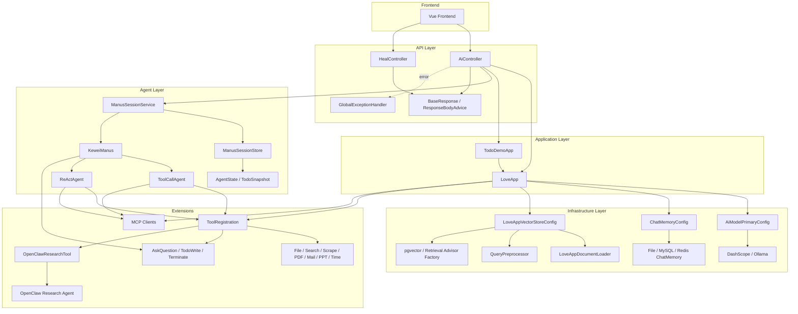

# Kewei AI Agent

一个基于 Spring Boot + Spring AI 的 AI Agent 学习型工程项目。  
这个项目不是“调用一下大模型接口”的聊天 Demo，而是围绕 AI 应用后端常见能力，逐步把多模型接入、RAG、Tools、MCP、多步 Agent、流式交互、会话状态管理和前后端联调做成一套可运行、可演示、可继续扩展的工程作品。

> 项目定位：学习项目，但按工程作品的标准去设计、实现和整理。  
> 适合场景：练手、作为 Spring AI / AI Agent 实践模板继续扩展。  
> 开发过程记录见：[PROCEDURES.md](/Users/zhukewei/Downloads/dev/codes/kewei-ai-agent/PROCEDURES.md)

## 我完成了什么

从后端工程角度，这个项目重点体现的是：

- 基于 Spring Boot + Spring AI 组织 AI 应用基础设施
- 把聊天、RAG、Tools、MCP、Agent 等能力统一收敛到可复用的应用层
- 处理多数据源、多模型 Bean、会话状态、异常包装、SSE 事件流这些工程细节
- 为复杂任务设计了 Manus 多步执行链路，支持 TodoWrite、用户补充信息、任务续跑
- 完整的测试覆盖和前后端联调，保证了代码的可验证性，健壮性和可演示性

## 技术栈

`Java` `Spring Boot` `Spring AI` `Maven` `MyBatis-Plus` `MySQL` `Redis` `PostgreSQL / pgvector` `Ollama` `DashScope` `Vue 3` `SSE` `MCP`

## 功能图

| 模块 | 当前能力 |
| --- | --- |
| 模型接入 | DashScope、Ollama |
| 对话能力 | 同步、流式、结构化输出、多模态图片对话 |
| 会话记忆 | file / mysql / redis 可切换 |
| RAG | Markdown 文档加载、向量化、检索增强、关键词增强、状态过滤 |
| Tools | 文件读写、网页搜索、网页抓取、资源下载、PDF 转图、邮件发送、时间查询、PPT 生成 |
| MCP | 图片搜索 MCP Server、图片生成 MCP Server |
| Agent | ReAct、多步 Tool Calling、终止机制、TodoWrite、AskUserQuestion |
| Research | Spring AI 主控 + OpenClaw 调研执行代理 |
| 前端联调 | 聊天界面、流式渲染、问题补充、Todo 进度展示 |

## 项目架构



## 核心模块

### 1. 应用层

- [`src/main/java/com/kiwi/keweiaiagent/app/LoveApp.java`](/Users/zhukewei/Downloads/dev/codes/kewei-ai-agent/src/main/java/com/kiwi/keweiaiagent/app/LoveApp.java)
  统一封装文本对话、结构化输出、多模态、RAG、Tools、MCP、会话记忆等能力。
- [`src/main/java/com/kiwi/keweiaiagent/controller/AiController.java`](/Users/zhukewei/Downloads/dev/codes/kewei-ai-agent/src/main/java/com/kiwi/keweiaiagent/controller/AiController.java)
  暴露同步、流式、SSE、图片上传、Agent 相关接口。

### 2. Agent 与会话状态

- [`src/main/java/com/kiwi/keweiaiagent/agent/KeweiManus.java`](/Users/zhukewei/Downloads/dev/codes/kewei-ai-agent/src/main/java/com/kiwi/keweiaiagent/agent/KeweiManus.java)
  应用级多工具 Agent。
- [`src/main/java/com/kiwi/keweiaiagent/agent/ManusSessionService.java`](/Users/zhukewei/Downloads/dev/codes/kewei-ai-agent/src/main/java/com/kiwi/keweiaiagent/agent/ManusSessionService.java)
  管理任务启动、续跑、问题补充和工具子集选择。
- [`src/main/java/com/kiwi/keweiaiagent/agent/ManusSessionStore.java`](/Users/zhukewei/Downloads/dev/codes/kewei-ai-agent/src/main/java/com/kiwi/keweiaiagent/agent/ManusSessionStore.java)
  保存运行状态、中间问题和 Todo 快照。

### 3. RAG 与检索增强

- [`src/main/java/com/kiwi/keweiaiagent/rag/LoveAppVectorStoreConfig.java`](/Users/zhukewei/Downloads/dev/codes/kewei-ai-agent/src/main/java/com/kiwi/keweiaiagent/rag/LoveAppVectorStoreConfig.java)
- [`src/main/java/com/kiwi/keweiaiagent/rag/PgVectorVectorLoadMarkdownConfig.java`](/Users/zhukewei/Downloads/dev/codes/kewei-ai-agent/src/main/java/com/kiwi/keweiaiagent/rag/PgVectorVectorLoadMarkdownConfig.java)
- [`src/main/java/com/kiwi/keweiaiagent/query/QueryPreprocessor.java`](/Users/zhukewei/Downloads/dev/codes/kewei-ai-agent/src/main/java/com/kiwi/keweiaiagent/query/QueryPreprocessor.java)

这部分负责文档加载、向量写入、查询预处理和检索增强配置。

### 4. 工具与外部能力接入

- [`src/main/java/com/kiwi/keweiaiagent/tools/ToolRegistration.java`](/Users/zhukewei/Downloads/dev/codes/kewei-ai-agent/src/main/java/com/kiwi/keweiaiagent/tools/ToolRegistration.java)
  统一管理工具注册。
- [`src/main/java/com/kiwi/keweiaiagent/tools/OpenClawResearchTool.java`](/Users/zhukewei/Downloads/dev/codes/kewei-ai-agent/src/main/java/com/kiwi/keweiaiagent/tools/OpenClawResearchTool.java)
  研究任务委派给 OpenClaw。
- [`kewei-image-search-mcp-server`](/Users/zhukewei/Downloads/dev/codes/kewei-ai-agent/kewei-image-search-mcp-server)
  图片搜索 MCP 服务。
- [`kewei-image-generation-mcp-server`](/Users/zhukewei/Downloads/dev/codes/kewei-ai-agent/kewei-image-generation-mcp-server)
  图片生成 MCP 服务。

## 工程亮点

### 1. 不只堆功能，也处理工程问题

- 多 Provider 并存时的 Bean 优先级和装配冲突
- ChatMemory 的 file / mysql / redis 切换
- pgvector 数据源与主应用数据源分离
- SSE 流式事件扩展到 `question` 和 `todo`
- 全局异常处理和统一响应包装

### 2. 不只做一次性 Demo，也考虑可验证性

- 有较完整的单测和集成测试
- Agent、Tools、RAG、Controller 都有对应测试代码
- 支持前后端联调

### 3. 不只接模型，也做能力编排

- 基础聊天能力
- 检索增强问答
- 工具调用
- MCP 服务编排
- 多步 Agent 任务执行
- 外部研究代理协作

## 我在这个项目里的收获

- 更系统地理解了 Spring AI 在 Java 后端里的落地方式
- 不只是“调用模型”，而是开始关注状态、上下文、工具、检索和任务执行链路
- 对 AI 应用工程化的认识更完整，包括接口设计、异常处理、流式输出、测试和模块边界

## 项目结构

```text
kewei-ai-agent
├── src/main/java/com/kiwi/keweiaiagent
│   ├── agent
│   ├── app
│   ├── controller
│   ├── rag
│   ├── tools
│   └── config
├── src/test/java/com/kiwi/keweiaiagent
├── kewei-ai-agent-frontend
├── kewei-image-search-mcp-server
├── kewei-image-generation-mcp-server
└── PROCEDURES.md
```

## 后续可以继续扩展的方向

- 增加任务观测面板，展示 Agent 每一步的思考、工具调用和状态变化
- 补充权限控制、限流、审计日志等更贴近生产的能力
- 给不同任务域继续拆分独立 Agent 或独立 MCP 服务
- 完善部署文档，把项目升级为可直接在线演示的作品
